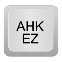

 

AutoHotkey EZ is a free and open source Library for AutoHotkey_L_v1.1.33.02

## Objectives ##

  1. Promote the use of Autohotkey for programmers of all skill levels and languages
  1. Make Autohotkey **Easy**, Effective, and Fun to use 
  1. Minimize the confusion when to use percent signs: `variable` or `%variable%` ?
  1. For AHK_L_v1.1 only, I have no plans to update for the forthcoming AHL_L_v2

## AutoHotkey_L ##

AutoHotkey is a free, open source macro-creation and automation software utility that allows users to automate repetitive tasks. It is driven by a custom scripting language that is aimed specifically at providing keyboard shortcuts, otherwise known as hotkeys.
    
Links: [Autohotkey Home](https://autohotkey.com/) and: [Autohotkey on GitHub](https://github.com/Lexikos/AutoHotkey_L)

# How to Use #

1. Download the [Latest Release](https://github.com/jasc2v8/AHKEZ/releases)
1. Copy [Lib\AHKEZ.ahk](https://github.com/jasc2v8/AHKEZ/blob/main/Lib/AHKEZ.ahk) to your [AHK Library folder](https://www.autohotkey.com/docs/Functions.htm#lib)
1. Add the following at the top of your AHK script: `#Include <AHKEZ>`
1. Try the [Hello World](https://github.com/jasc2v8/AHKEZ/blob/main/AHKScripts/Examples/HelloWorld.ahk) example
1. Copy Lib\AHKEZ_API.ahk for use as a reference doc
1. Study the [AHKEZ docs](https://jasc2v8.github.io/AHKEZ/)
1. Write code using AHK_L_v1 or AHKEZ, or both!
1. Enjoy writing AHK scripts with minimal confusion when to use `variable` or `%variable%`

# AHKEZ Differences from AHK_L #

1. Most commands have Function() wrappers that don't require percent signs: (var) vs. %var%
1. Most Gui commands have Gui() wrappers intended for quick creation of simple Guis
1. AHKEZ adds several functions, see [Lib\AHKEZ.ahk](https://github.com/jasc2v8/AHKEZ/blob/main/Lib/AHKEZ.ahk)  and [AHKEZ docs](https://jasc2v8.github.io/AHKEZ/)

# AHKEZ Featured Items #

1. AHKScripts - checkout the \Gui_Templates and the \Tools
1. Demo - Gui demos using AHKEZ
1. Doc - html docs
1. Lib - the AKEZ.ahk and other library scripts, especially AHKEZ_Debug.ahk
1. Manuals - Notes and guides
1. UnitTest - checkout Run_Tests.ahk for tests and examples

  I can **highly** recommend the use of VSCode as an IDE for Autohotkey! I've documented A few easy steps to setup VSCode and a modified version of QuickLinks that is launched when VSCode starts.  VSCode has virtually everything and QuickLinks will launch AHK-specific tools.

    \Manuals\IDE\VSCode\VSCode_manual.txt

# Why AHKEZ? #

In summary, this is my 2020 COVID-19 Pandemic Quarantine Project to pass the time until the world can get back to work.

I've often had the need to automate tasks and keyboard shortcuts for my day job. I have a hobbyist background programming in Visual Basic and Pascal. The first scripting language I used was AutoIT which was very powerful but I found difficult to use and struggled with the syntax.

Recently I tried AutoHotkey and fell in love with it. However, as a hobbyist, I don't write code every day so when I want to write an AHK script I get stuck trying to figure out when to use the percent signs for variables or %variables%. I have the same issue with MSDOS.

I love AHK but I want to use it to write code without trying to remember the syntax and use of percent signs.  AHKEZ solves this problem -- Now I can just write code and enjoy this amazing language!

# Donations #

If AHKEZ helps you in some way, then please buy me a cup of coffee by clicking on the "donation" button below. Thank you.

